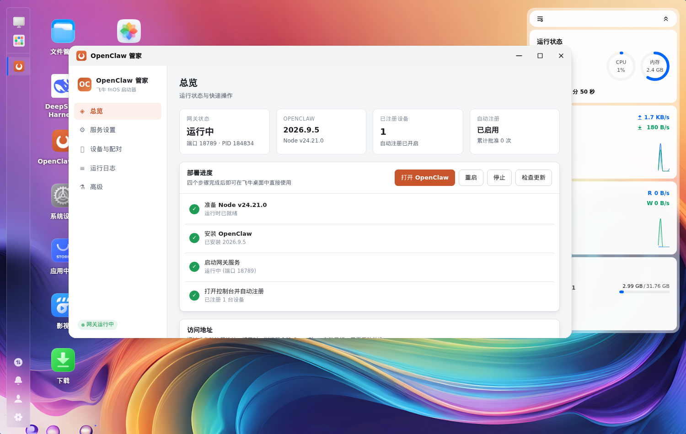
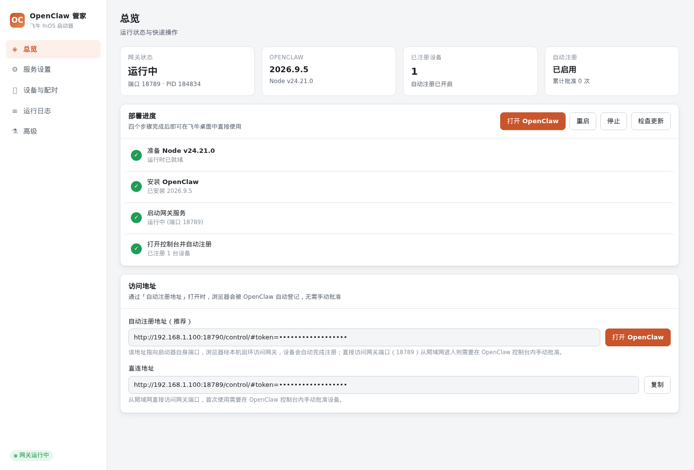
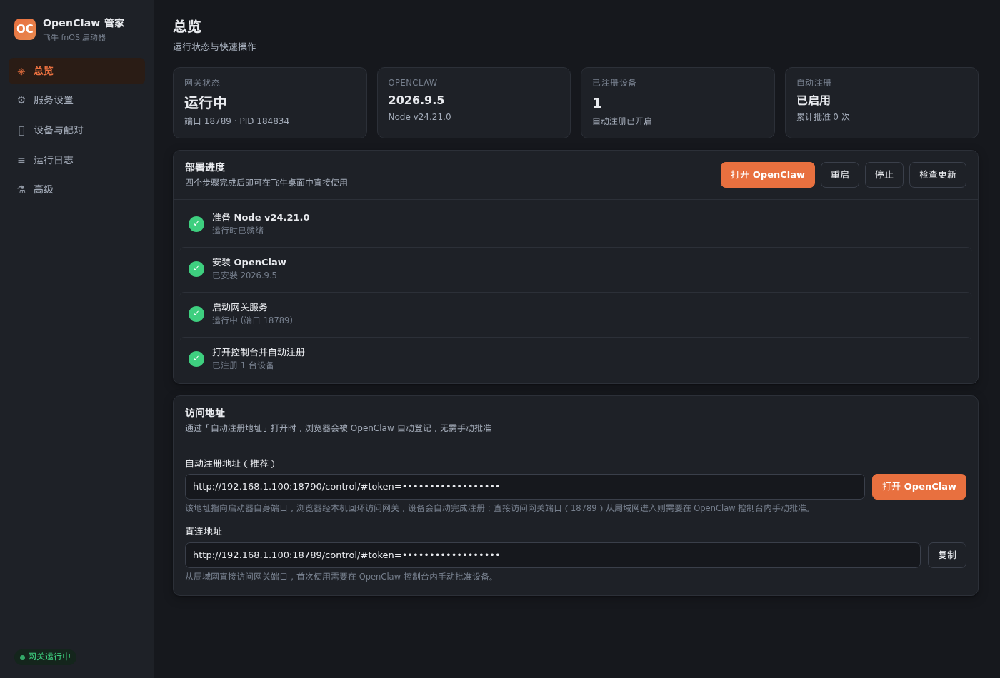
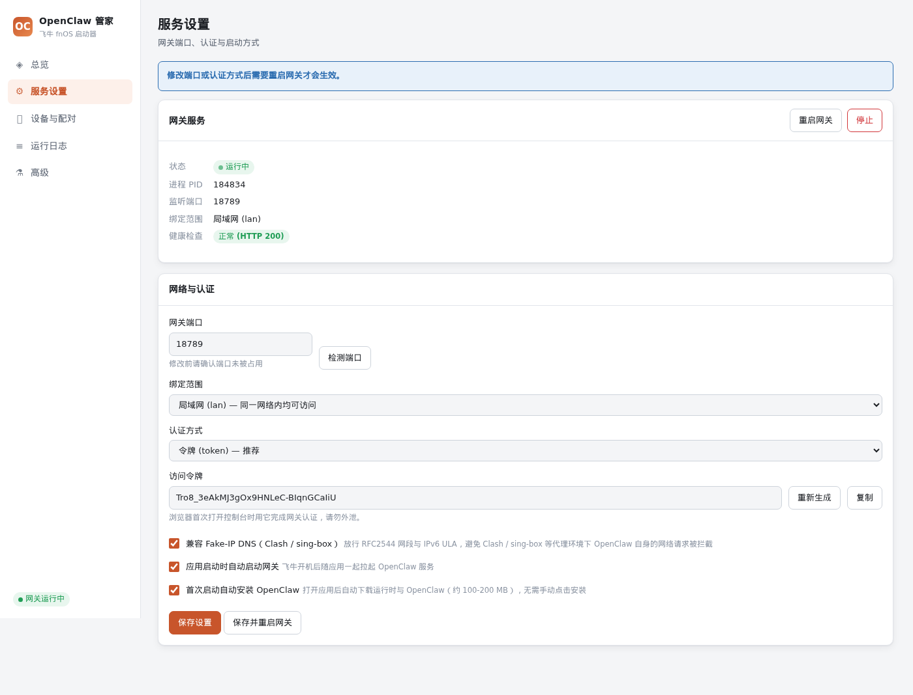
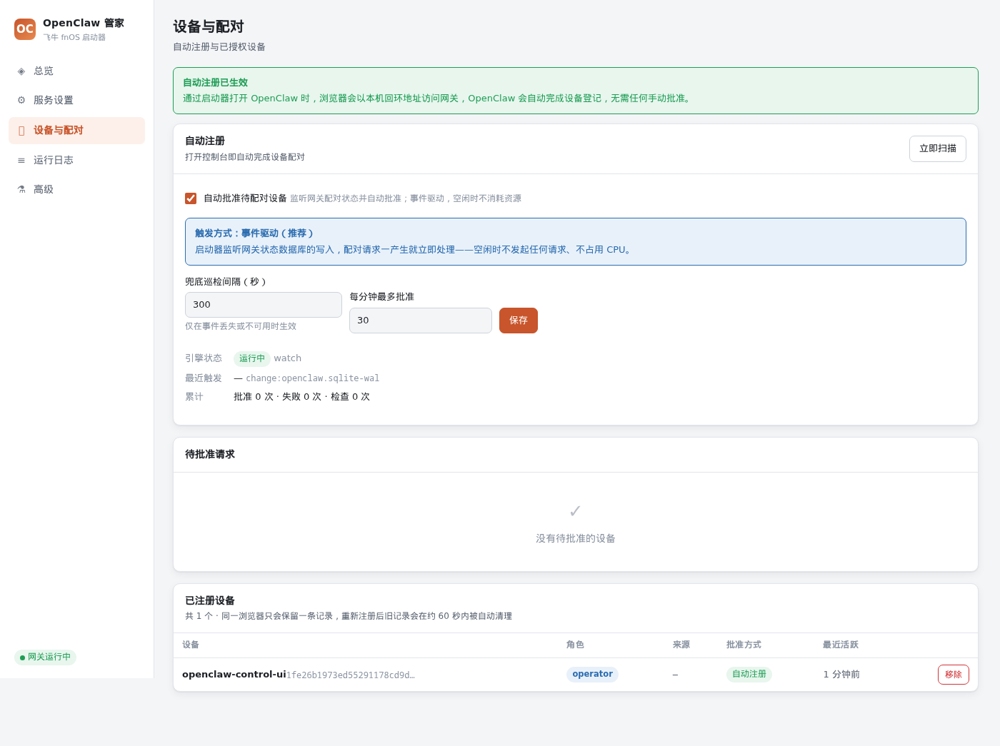
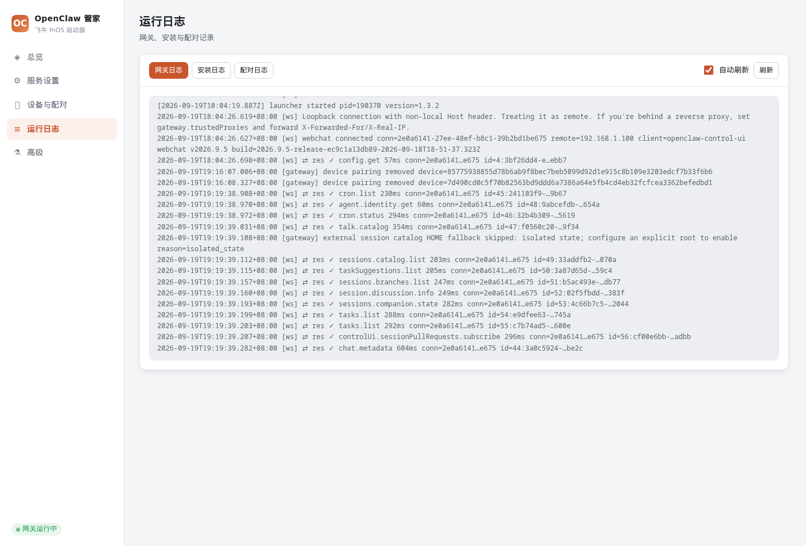
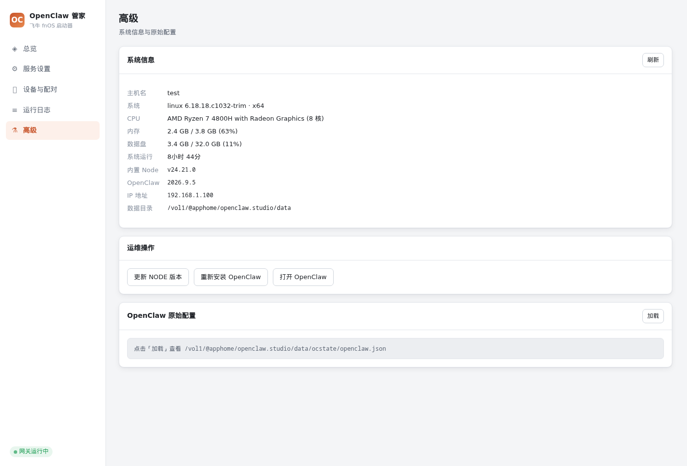

# OpenClaw 管家 · 飞牛 fnOS 启动器

面向飞牛 fnOS 的 **独立** OpenClaw 一体化启动器。从零实现，不基于官方或社区版本修改。

当前版本：**v1.3.2** · 应用名 `openclaw.studio` · 依赖 `nodejs_v24` · 要求 fnOS ≥ 1.1.3100

---

## 目录

- [它解决什么问题](#它解决什么问题)
- [v1.3.2 这一版做了什么](#v132-这一版做了什么)
- [安装](#安装)
- [首次启动会发生什么](#首次启动会发生什么)
- [界面说明](#界面说明)
- [「打开即自动注册」的原理](#打开即自动注册的原理)
- [运行机制](#运行机制)
- [常见问题](#常见问题)
- [飞牛集成的几个坑](#飞牛集成的几个坑)
- [构建与测试](#构建与测试)
- [项目结构](#项目结构)
- [版本历史](#版本历史)
- [运维说明](#运维说明)

---

## 它解决什么问题

OpenClaw 装到飞牛上，中间隔着一堆琐碎但会劝退人的步骤：

| 麻烦 | 本应用的处理 |
|---|---|
| 飞牛自带 Node 24.15.0，OpenClaw 要求 ≥ 24.16.0 | 自持 Node 运行时，不动系统环境 |
| 要手敲命令行装 OpenClaw | 首次启动自动完成，界面显示进度 |
| 浏览器打开控制台被挡在「等待批准设备」页 | 经本机回环访问，网关自己静默登记 |
| Clash / sing-box 环境下网络请求被拦 | 放行 RFC2544 网段与 IPv6 ULA |
| 配置散落各处，没有统一入口 | 服务、设备、日志统一面板 |

---

## v1.3.2 这一版做了什么

### 1. 自动注册改为事件驱动，空闲零开销

这是本版最重要的改动。

**改之前**：每 2 秒调一次 `device.pair.list`，而每次调用都要启动一个完整的 Node 进程
—— 实测 **单次 1.36 秒 CPU**。空闲时约 17 次/分钟，等于 **约 38% 单核持续占用**，
纯粹空转。

**改之后**：

```
网关状态库有写入
        │
        ▼
   fs.watch 触发
        │
        ▼
   去抖 400ms ──▶ 廉价预检（只读查一次待批准，13ms）
                        │
              有待处理 ──┴── 无 ──▶ 什么都不做
                  │
                  ▼
        device.pair.* RPC（1.36s，仅在实际需要时）
```

廉价预检直接以只读方式查状态库的待批准列表（13 ms，比 RPC 便宜 100 倍），
**仅作为过滤器**——真正的批准仍走公开 RPC。读不到就回退到直接调 RPC，
所以正确性不依赖内部表结构。

实测对比：

| | 旧实现 | v1.3.2 |
|---|---|---|
| 空闲 RPC 次数 | ~17 次/分钟 | **0** |
| 空闲 CPU | ~38% 单核 | **0%**（75 秒实测 0.03 秒） |
| 响应延迟 | 最多 2 秒 | 约 2.6 秒 |

同时修掉三个会让它空转的坑，见[飞牛集成的几个坑](#飞牛集成的几个坑)第 4 节。

### 2. 更名「OpenClaw 管家」

桌面图标、窗口标题、页面标题全部更新。内部应用名仍是 `openclaw.studio`
（改动它要重建数据目录与网关前缀，对使用者没有可见收益）。

### 3. 移除模型配置功能

启动器**不再写入任何模型／服务商配置**，从根源上杜绝与 OpenClaw 官方配置互相覆盖。
模型请在 OpenClaw 自带控制台的「模型设置」里配置。

仅保留一项网络相关的托管配置 `models.catalogRefresh.url`（固定官方目录地址，
使其在 Fake-IP DNS 环境下能通过 SSRF 校验）——这是网络设置，不是模型定义。

### 4. 部署进度第 4 步现在会正确变绿

「打开控制台并自动注册」原来写死了未完成状态，即使设备已注册仍显示橙色。现已按
实际注册数量判断。

### 5. 新增「清理重复设备」

浏览器把设备身份存在 localStorage 里、按源（origin）隔离，所以访问地址变化会被当成
新设备；而 OpenClaw 清理旧记录有 60 秒宽限期。本版：

- **固定控制台访问地址**为规范主机（`launcher.publicHost`，留空取首个局域网 IP），
  浏览器始终复用同一个源，不会因主机名变化重新注册
- 提供「清理重复设备」按钮，按 OpenClaw 自身分组规则立即清理，保留最近使用的一条，
  默认先预检数量再执行

### 6. 重新安装需要二次确认

高级页的「重新安装 OpenClaw」现在要求输入 `确认重新安装` 才会执行。

### 7. 修正静态资源缓存策略

原来 UI 资源带 1 小时强缓存。某次升级改变接口字段后，浏览器仍执行上一版 `app.js`，
界面渲染成空白。现改为 `no-cache` 协商缓存（未变更仍走 304），并给资源 URL 打版本指纹。

---

## 安装

### 从 Releases 安装（推荐）

1. 到 [Releases](https://github.com/sunnyday666/fn-openclaw-launcher/releases) 下载
   `openclaw.studio_1.3.2.fpk`
2. 飞牛桌面 → **应用中心** → 左下角 **手动安装**
3. 选择存储空间，点 **从电脑上传**，选中 fpk 文件
4. 出现「未经验证应用的安全提示」时点 **同意**
5. 安装完成后桌面会出现 **OpenClaw 管家** 图标


> **别装错**：应用中心里还有一个飞牛官方的「飞牛 OpenClaw」（分类 `AI｜实用效率`），
> 与本应用**不是同一个**。本应用的桌面名称是 **OpenClaw 管家**、包名 `openclaw.studio`，
> 需按上面的「手动安装」上传 fpk 安装。

> **注意**：本应用与旧版「OpenClaw 启动器」（`openclaw.launcher`）也是两个不同的应用，
> 应用名不同，**可以并存安装、互不覆盖**。详见 [MIGRATION.md](MIGRATION.md)。

### 从源码构建

```bash
./scripts/build-fpk.sh          # 产物在 dist/
```

需要 `fnpack`（飞牛官方打包工具）与 `nodejs_v24`。

---

## 首次启动会发生什么

安装完成后应用会随 fnOS 一起启动，并在后台自动完成三件事：

| 步骤 | 说明 | 耗时 |
|---|---|---|
| 准备 Node | 从 nodejs.org 下载 Node 24.x LTS 到应用数据目录 | 约 20 秒 |
| 安装 OpenClaw | 按 `engines.node` 约束解析并安装本机兼容的最新稳定版 | 约 20-60 秒 |
| 启动网关 | 拉起 OpenClaw 网关并等待就绪 | 约 10 秒 |

**总量约 100-200 MB，视网络情况 1-3 分钟。** 全部在后台进行，界面实时显示进度。
完成后「总览」页四个步骤会全部变绿。

不想自动安装可以在「服务设置」里关闭「首次启动自动安装 OpenClaw」。

---

## 界面说明

在飞牛桌面点开图标后，应用以**飞牛内嵌窗口**打开 —— 不是新标签页，也不是跳转到外部网页：



五个面板，深浅色跟随飞牛桌面主题，无构建步骤、无前端依赖。

> 以下截图取自真实运行实例，已对网关令牌与主机 IP 做脱敏处理。

### 总览



- **状态卡片**：网关状态（含端口与 PID）、OpenClaw 与 Node 版本、已注册设备数、自动注册开关
- **部署进度**：四步状态指示，做完变绿
- **访问地址**：给出**自动注册地址**（推荐）与直连地址，一键打开或复制
- **快捷操作**：一键安装 / 启动 / 重启 / 停止 / 打开 OpenClaw

深色主题：



### 服务设置



| 项目 | 说明 |
|---|---|
| 网关端口 | 默认 18789，修改前可点「检测端口」确认占用 |
| 绑定范围 | `lan`（局域网可访问）或 `loopback`（仅本机） |
| 认证方式 | `token`（推荐）或无认证 |
| 访问令牌 | 可重新生成、复制 |
| Fake-IP 兼容 | 放行 RFC2544 网段与 IPv6 ULA |
| 自动启动网关 | 随应用一起拉起 |
| 首次启动自动安装 | 关闭后需手动点安装 |

### 设备与配对



- **自动注册开关**与触发方式说明（事件驱动 / 定时轮询）
- **待批准请求**：从局域网直连网关端口时产生的请求会列在这里
- **已注册设备**：设备名、角色、来源、批准方式、最近活跃；可单个移除或清理重复
- **自动批准记录**

上图中「引擎状态 · watch」「最近触发 · `change:openclaw.sqlite-wal`」「累计 检查 **0** 次」就是事件驱动的直接体现：
配对引擎处于文件监听状态，**没有待处理的配对请求时一次也不发起检查和 RPC**。

> 待批准请求需要手动批准的原因见[「打开即自动注册」的原理](#打开即自动注册的原理)最后一节。

### 运行日志



网关 / 安装 / 配对三类日志切换，可从最新处回看 400 行，支持自动刷新。

### 高级



- 系统信息（主机、CPU、内存、磁盘、运行时长、IP、数据目录）
- 运维操作：更新 NODE 版本、重新安装 OpenClaw（需二次确认）、打开 OpenClaw
- OpenClaw 原始配置只读查看（用于诊断）

---

## 「打开即自动注册」的原理

OpenClaw 的网关只对**受信任的本机（回环）连接**静默批准设备配对。浏览器直接访问
`http://<NAS-IP>:18789/` 属于远程连接，会被挡在「等待批准」页面后面——这是飞牛上使用
OpenClaw 最大的摩擦点。

本项目不去绕过这个机制，而是让访问**本来就发生在回环上**：

```
浏览器 ──▶ 启动器 (18790 / fnOS 应用套接字) ──▶ 127.0.0.1:18789 网关
                    ↑ 反向代理（含 WebSocket）
```

启动器把 OpenClaw 控制台反向代理到自己的地址下，网关看到的连接来自 `127.0.0.1`，
于是按其自身设计（`gateway.nodes.pairing.autoApproveLocal`）**静默、持久地**完成设备登记。

实测（取自真实运行实例的设备记录与引擎状态）：

```jsonc
// GET /api/devices —— 设备确实经由「静默」通道登记
{ "label": "openclaw-control-ui", "role": "operator", "remoteIp": null,
  "approvedVia": "silent" }

// 同一次运行中的配对引擎 —— 一次轮询、一次 RPC 都没发过
{ "mode": "watch", "lastTrigger": "change:openclaw.sqlite-wal",
  "stats": { "approvals": 0, "polls": 0, "skipped": 516 } }
```

`approvedVia: "silent"` 说明设备是**网关自己**静默登记的，而不是启动器代批；
引擎侧 `approvals: 0` 则说明启动器全程**没有代替批准过任何请求**。两者互相印证：
自动注册确实来自回环访问这一事实，而不是启动器在"帮忙批准"。

网关认证（令牌）依然强制生效，被自动化的只有设备配对这一步。

**为什么控制台在新标签页打开而不是内嵌？** OpenClaw 控制台使用根绝对路径资源
（`/control/assets/...`），套在飞牛门户前缀下会解析失败。因此面板内嵌在飞牛桌面窗口，
而控制台在新标签页打开（走启动器端口，同源，一切正常）。

**关于待批准请求**：从局域网直接访问网关端口 18789 时，飞牛 OpenClaw 要求
`operator.admin` 权限才能批准，而启动器持有的令牌没有该权限，**无法代为批准**。
这类请求会在界面上标出，需在 OpenClaw 自带控制台里批准。正常使用（走「打开 OpenClaw」）
不涉及此路径。

---

## 运行机制

### 自持 Node 运行时

飞牛自带 `nodejs_v24` 为 24.15.0，而 `openclaw@2026.9.5` 要求 `>=24.16.0 <25`。
启动器自行下载 Node 24.x LTS 到应用数据目录，安装 OpenClaw 前自动解析 `engines.node`
约束，挑选**本机运行时真正兼容的最新稳定版**。

好处：不与任何飞牛应用争抢系统 Node，升级本应用也不会影响别人。

### 配置写入始终经过 OpenClaw 校验

`openclaw.json` 是 JSON5（允许注释与尾逗号）。启动器不会用 `JSON.parse` 读它——解析
失败会导致整个配置被覆盖——而是先做 JSON5 容错解析，再通过 `openclaw config patch`
写入，校验不通过的配置**永远不会落盘**。

启动器只托管三项网络相关配置：`gateway.mode/bind/port`、`gateway.auth`、
`gateway.controlUi.allowedOrigins`，以及 Fake-IP 兼容所需的 SSRF 放行。

### Fake-IP DNS 兼容

Clash / sing-box 等会把所有域名解析到 `198.18.0.0/15`，触发 OpenClaw 的 SSRF 防护
（`Blocked: resolves to private/internal/special-use IP address`）。启动器处理三处：

| 现象 | 处理方式 |
|---|---|
| 远程模型目录被拦截 | 显式声明 `models.catalogRefresh.url`，走网关的「已配置来源」放行路径 |
| 网页抓取、浏览器被拦截 | 放行 `allowRfc2544BenchmarkRange` 与 IPv6 ULA |
| 服务商图标 404 | 由启动器代理层直接获取（仅限图标 CDN 白名单） |

---

## 常见问题

**Q：桌面图标点了没反应 / 窗口空白？**

先确认应用状态：应用中心里应为 `running`。若刚升级过，**强刷一次飞牛桌面**（旧窗口可能
缓存了改配置前的地址）。

**Q：设备列表里同一个浏览器出现多条记录？**

OpenClaw 清理被取代的记录有 60 秒宽限期，宽限期内新旧记录会并存。点「清理重复设备」
可立即整理。若频繁出现，检查是否用不同的主机名／IP 访问过——那会被视为不同源。

**Q：为什么端口有 18789 和 18790 两个？**

`18789` 是 OpenClaw 网关自身端口（控制台、API）；`18790` 是本启动器的管理面板端口，
也是打开控制台时走的地址（为了同源）。两者都可在界面修改。

**Q：能装本地模型吗？**

能。Ollama 监听 `127.0.0.1:11434`，在 OpenClaw 控制台的模型设置里添加即可。
本应用不介入模型配置。

**Q：卸载会丢数据吗？**

不会。数据在 `<安装卷>/@apphome/openclaw.studio/data`，卸载默认保留，重装后继续使用。

**Q：和官方/旧版启动器冲突吗？**

不冲突。应用名不同（本应用 `openclaw.studio`），可与飞牛官方上架的「飞牛 OpenClaw」
以及旧版社区启动器并存安装。注意各方的 OpenClaw 实例、端口、数据目录相互独立，
**不会共用配置** —— 装在一起时请留意别把端口配成同一个。

**Q：日志在哪？**

界面「运行日志」面板可看；文件在 `data/logs/`（`gateway.log` / `install.log` / `pairing.log`）。

---

## 飞牛集成的几个坑

把应用嵌进飞牛桌面踩过的坑，每一个都会让桌面窗口打不开，全部记在这里。

### 1. 不要写 `ctl_stop` 字段

`manifest` 里加上 `ctl_stop = false` 会让飞牛应用中心认为**该应用不可被启动/停止**：

- 应用状态永远停在 `nostart`，即使进程实际在运行
- `appcenter-cli start` 直接返回 `Failed to launch app. error code 10332`
- 桌面不生成快捷方式

### 2. 网关路径前缀不能含点号

应用名可以是 `openclaw.studio`（含点），但 `gatewayPrefix` / `url` 必须用不含点号的路径：

```json
"gatewayPrefix": "/app/openclaw-studio",     // 对
"gatewayPrefix": "/app/openclaw.studio",     // 错：门户对 /app/openclaw.studio 直接 404
```

**URL 前缀不需要等于应用名。**

### 3. 门户转发的是完整路径，且不补尾斜杠

| 现象 | 原因 | 处理 |
|---|---|---|
| 所有静态资源返回 HTML | 门户把 `/app/openclaw-studio/style.css` **原样**转给应用套接字，不剥离自己的挂载前缀；路径不匹配就落到 SPA 兜底 | 服务端剥离前缀后再路由 |
| 资源 404 到 `/app/style.css` | 桌面 iframe 地址是 `/app/openclaw-studio`（**没有尾斜杠**），相对路径相对 `/app/` 解析 | 服务端 302 到带尾斜杠的规范路径 |

第二条最初想在页面里动态插 `<base>` 解决，**行不通**：浏览器的预加载扫描器会在内联脚本
执行之前就去取 `<link>`/`<script>`。服务端重定向才是可靠做法。

### 4. 自动注册的三个空转陷阱

事件驱动实现里每一个都曾导致无谓的 RPC：

1. **反馈回路** —— 批准用的 RPC 会让网关写状态库，再次触发监听。用去抖 + 最小间隔抑制。
2. **无差别触发** —— 网关自身心跳等写入也触发监听，必须靠廉价预检过滤。
3. **过期残留** —— 超过 5 分钟 TTL 的待批准行仍留在表里但 RPC 会忽略；按**数量**过滤
   会一直空跑，必须按**时间**过滤。

### 5. 静态资源必须协商缓存，并按版本加指纹

长时间 `max-age` 会造成「新后端配旧前端」：浏览器执行上一版 `app.js` 去读已移除的字段，
界面出现空白区域。`no-store` 又会浪费 304 的收益。正确做法是 `no-cache` + ETag，
再给资源 URL 打版本指纹。

### 排查过程中的一个陷阱

**飞牛在安装时就把 `ui/config` 缓存进应用中心数据库了**，之后修改已安装目录里的
`ui/config` 再重启应用**不会生效**。任何 `ui/config` 改动都必须**卸载后重新安装**才能验证。

判断方法：改掉已安装 `ui/config` 里的 `title`，重启后应用中心里显示的仍是旧标题。

---

## 构建与测试

```bash
# 打包（产物在 dist/）
./scripts/build-fpk.sh

# 生成图标（已提交，通常无需重跑）
node scripts/make-icons.mjs
```

> `fnpack build` 打包失败时**仍然返回 0**，因此 `build-fpk.sh` 会检查输出文本而不是退出码；
> 它同时在一个干净的暂存目录中构建（`fnpack` 会复制整个源码目录）。

测试脚本需要浏览器与凭据，全部通过环境变量传入：

```bash
export PLAYWRIGHT_BROWSERS_PATH=.dev/browsers
export DESKTOP_URL=http://nas:5666 DESKTOP_USER=me DESKTOP_PASS='...'

# 飞牛桌面内嵌模式全流程：登录 → 点图标 → 内嵌界面 → 打开控制台 → 自动注册
node scripts/e2e-embedded.mjs

# 自动注册端到端
node scripts/e2e-pairing.mjs --api http://127.0.0.1:18790

# 五个面板渲染 + 深色主题
node scripts/ui-smoke.mjs --base http://127.0.0.1:18790
```

三者都会在出现任何控制台错误、页面异常或失败请求时以非零码退出。

---

## 项目结构

```
├── manifest                    # FPK 元数据
├── app/
│   ├── server/
│   │   ├── index.js            # HTTP 服务、路由、生命周期
│   │   └── lib/
│   │       ├── paths.js        # 路径解析（含 TRIM_* 归属校验）
│   │       ├── openclaw.js     # 运行时与 OpenClaw 安装、配置读写
│   │       ├── gateway.js      # 网关进程管理
│   │       ├── pairing.js      # 自动注册引擎（事件驱动）
│   │       ├── proxy.js        # 控制台反向代理 + 图标
│   │       ├── settings.js     # 启动器自身设置
│   │       └── tasks.js        # 长任务管理
│   └── ui/                     # 前端（原生 JS，无构建）
├── cmd/                        # fnOS 生命周期脚本
├── config/                     # privilege / resource
├── wizard/install              # 安装向导
└── scripts/                    # 构建、部署与测试脚本
```

---

## 版本历史

| 版本 | 内容 |
|---|---|
| **v1.3.2** | 事件驱动注册（空闲 0 RPC / 0% CPU）；修复重试风暴与过期残留导致的空转 |
| v1.3.0 | 自动注册由轮询改为事件驱动 |
| v1.2.0 | 更名「OpenClaw 管家」；移除模型配置功能；修复第 4 步状态；新增清理重复设备 |
| v1.1.2 | 修复升级后界面空白（静态资源缓存策略） |
| v1.1.0 | 模型目录改读 OpenClaw 官方目录（该功能已于 v1.2.0 移除） |
| v1.0.6 | 修复桌面内嵌空白页（门户前缀与尾斜杠） |
| v1.0.4 | 桌面入口改回 `iframe` 内嵌模式，路径前缀去点号 |
| v1.0.2 | 移除无效的 `ctl_stop` 字段 |
| v1.0.0 | 首个版本 |

> 本仓库 v1.0.x 的早期提交属于**另一个产品**（社区版 `openclaw.launcher`），
> 已归档到标签 `legacy-launcher-v1.0.6`。详见 [MIGRATION.md](MIGRATION.md)。

---

## 运维说明

- **数据目录**：`<安装卷>/@apphome/openclaw.studio/data`（升级不覆盖，卸载默认保留）
- **运行用户**：独立低权限用户 `openclaw.studio`，非 root
- **默认端口**：网关 `18789`、管理面板 `18790`
- **卸载**：应用中心卸载即可；数据目录保留，便于重装后继续使用
- **日志**：`data/logs/` 下 `gateway.log` / `install.log` / `pairing.log`

### 已验证的环境

飞牛 fnOS 1.2.0604 · Debian 12 · 内核 6.18.18.c1032-trim · x86_64 ·
Node 24.21.0 · OpenClaw 2026.9.5

---

## 许可证

本项目为独立实现，仅用于学习与自用。OpenClaw 本身遵循其官方许可证。
